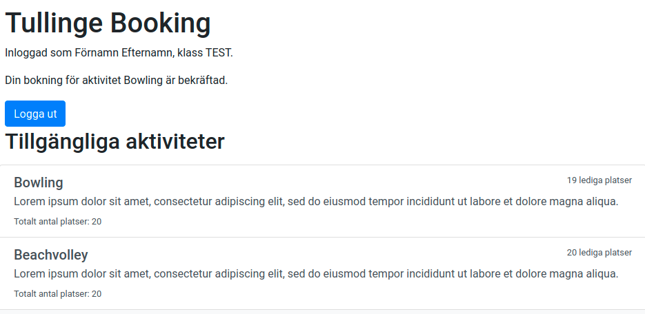

# Booking

A booking system for the yearly event **Allaktivitetsdag** at Tullinge gymnasium.

Demo site at [booking.tullingelabs.se](http://booking.tullingelabs.se/login)

## Requirements

- Docker & docker-compose
- Python 3
- Python libraries (look in `requirements.txt`, can be installed using `pip install -r requirements.txt`)
- Google API credentials for "Google Sign-In for Websites" (see [this article](https://developers.google.com/identity/sign-in/web/sign-in)).

### Environment variables

These environment variables need to be set (except the ones which have defaults) before either running the application locally or building the Docker container (deployment).

- `REDIS_HOST` - default is `localhost`
- `MYSQL_HOST` - default is `localhost`
- `MYSQL_USER` - default is `admin`
- `MYSQL_PASSWORD` - default is `do-not-use-in-production` (override this in production!)
- `MYSQL_DATABASE` - default is `booking`
- `GOOGLE_CLIENT_ID` - must be set manually, used for communicating with Google API.
- `GSUITE_DOMAIN_NAME` - must be set manually, used for limiting logins to a specific G Suite organization
- `PORT` - must be set manually, if using Docker deployment

### Instructions (running locally)

1. `docker-compose up -d`
2. `python scripts/setup_db.py`
3. `python scripts/create_admin.py`
4. `python main.py`

### Instructions (deployment)

1. Set `DOCKER_HOST` and `MYSQL_PASSWORD`
2. `docker-compose -f docker-compose.yml -f prod.yml up -d`
3. `docker exec booking_app_1 python scripts/setup_db.py`
4. `docker exec -it booking_app_1 python scripts/create_admin.py`

## Key Features

- **Student interface** (`/`)
  - Authentication using Google
  - Booking activities that has multiple questions, both written answers and options are supported (and support for optional and obligatory questions).
  - Re-booking to another activity at a later point.
- **Admin interface** (`/admin`)
  - Multiple admin users
  - Creating, deleting and updating activities and classes on the fly.
  - Creating and deleting questions.
  - Viewing class lists per class or per activity (with student answers for activities).
  - Granting privilegies to activity leaders, accounts with restricted access (only access to specific activities and their class lists).
- **Activity leader interface** (`/leader`)
  - Viewing class lists for activities.
  - The same user can be marked as activity leader for multiple activities.

## Navigating the interface

Once you got the webserver running and an initial admin account created, you can log in to the admin interface by visiting `/admin`.

Once logged in, go ahead and click `Aktiviteter` to create a new activity. From each activity, you can create questions that the students have to answer when choosing the activity.

You can also add email addresses to activity leaders who should have access class lists for a specific activity. Leaders can access the interface by visiting `/leader` and signing in with their Google accounts (as specified when the admin grants privileges).

Then you can move on to the `Klasser` page, where you can create school classes that will be shown to the students when they initially set up their accounts. A join code will also be generated which is used by the students when initially signing up (when the student enters the code they will be registered to that class).

Students sign in using Google, which makes authentication a lot smoother. The system fetches the first name and surname of the user using information from Google. The student just has to type in the 8 digit code to be registered to the class. From the interface, the student can browser activities, book activities and re-book activities.

## User stories

- As a **student** I want to be able to **login**
- As a **logged in student** I want to be able to **browse activities**
- As a **logged in student** I want to be able to **register to a class using a join code**
- As a **registered student** I want to be able to **see a confirmation of my choices**

---

- As a **student who have already registered** I want to be able to **restart and update my choices**

---

- As a **admin** I want to be able to **login with my username and password**
- As a **logged in admin** I want to be able to **get a list of registered users per activity** so that I can **inform activity leaders**
- As a **logged in admin** I want to be able to **get a list of registered users per class** so that I can **inform class mentors**
- As a **logged in admin** I want to be able to **regster new admins**
- As a **logged in admin** I want to be able to **remove old admins**
- As a **logged in admin** I want to be able to **change password and username**

## Other requirements

- There should be a limit of available spots per activity
- Students who are registering for **bowling** should be able to select if they want food or not

## Contributing

Feel free to open an issue or send in a pull request. All code should be formatted using [black](https://github.com/psf/black). This project uses the semantic versioning convention, see [CHANGELOG.md](CHANGELOG.md) for more information.
